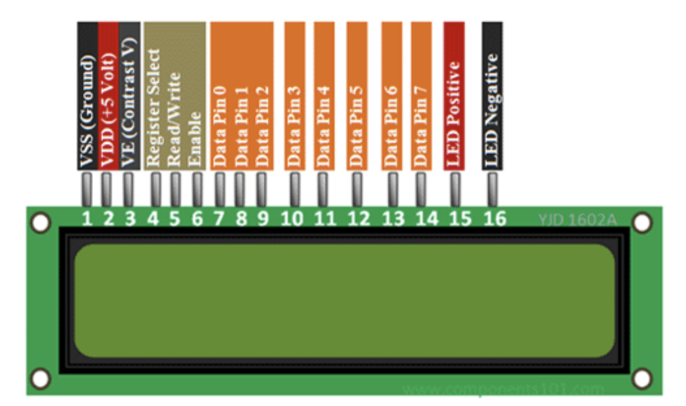

# Speedbot

The speedbot appliance will check your internet upload and download speed on a periodic basis. Prometheus intrumentation has been done to help track upload and download speed.

---

# Part 1 - Overview
## Hardware components needed
If you are a hobbiest you may have all of the parts needed to build out the Speedbot device. 
* [Iconikal Rockchip RK3328] - The Speedbot computer
* [16x2 Serial LCD display I2C] - 16 column LCD display.
* [20x4 Serial LCD display I2C] - 20 column LCD display.
* [Logic Converter] - needed for 20x4 display
* [5V 3A Power adapter] - 5V power adapter
* [Purchase] - Buy the board!

[Iconikal Rockchip RK3328]: <https://liliputing.com/2020/09/this-10-single-board-computer-is-faster-than-a-raspberry-pi-3.html>
[5V 3A Power adapter]: <https://www.ebay.com/itm/AC-Converter-Adapter-DC-5V-3A-Power-Supply-Charger-5-5mm-x-2-1mm-US-3000mA-/271505054908>
[Purchase]: <https://pine64.com/product/rock64-single-board-computer/?v=0446c16e2e66>

### Supported Displays
[16x2 Serial LCD display I2C]: <https://circuitdigest.com/article/16x2-lcd-display-module-pinout-datasheet/>
[20x4 Serial LCD display I2C]: <https://protosupplies.com/product/lcd2004-20x4-i2c-blue-lcd-display/>
[Logic Converter]: <https://phppot.com/iot/guide-to-setup-raspberry-pi-with-lcd-display-using-i2c-backpack/>

## Software libraries needed
Speedbot is coded using Python3. The reason I chose Python to build Speedbot is because it is easy to understand and easy to pick up. It is also one of the most popular programming langauges around, and can be used to build everything from simple scripts to machine learning algorythems.

* [OS] - Armbian
* [Python3] - The base language used in PiTemp.
* [PahoMqtt] - The Pyhton MQTT library used to send data.
* [Sqlite3] - A simple database used to store metrics.
* [Schedule] - The Python time scheduling library.
* [R64GPIO] - Python class to control Rpi GPIO interface.
* [jinja2] - Expressive template libraryBlinka.
* [Pureio] - Pure Python access to SPI and 
* [Prometheus] - Prometheus Python Library

[Python3]: <https://www.python.org/>
[PahoMqtt]: <https://www.eclipse.org/paho/>
[Sqlite3]: <https://docs.python.org/3/library/sqlite3.html>
[Schedule]: <https://pypi.org/project/schedule/>
[R64GPIO]: <https://pypi.org/project/RPi.GPIO/>
[jinja2]: <https://pypi.org/project/Jinja2/>
[Pureio]: <https://github.com/adafruit/Adafruit_Python_PureIO/tree/1.0.4>
[OS]: <https://www.armbian.com/newsflash/armbian-20-08-caple/>
[Prometheus]: <https://github.com/prometheus/client_python>

## Python library versions
| Library | Version  |
| ------------ | ------------ |
| jinja2 | 2.10.1  |
| docker | 4.4.1 |
| adafruit-blinka |  4.2.0 |
| schedule | 0.6.0  |
| paho-mqtt | 1.5.0 |
| gunicorn | 20.0.4 |
| requests | 2.21.0 |
| prometheus | 0.9.0

## Architectural diagram

### Bread Board

### Schematic

# Part 2 - Build the Speedbot

## Set up the Speedbot

Run the following script to set up the speedbot device, and pull the stable container that will run the software.
```
#!/bin/bash -x

sudo apt-get update
sudo apt-get upgrade

apt install docker.io
systemctl enable docker
systemctl start docker

apt-get install network-manager
systemctl start NetworkManager.service
systemctl enable NetworkManager.service

#Generate an unchangable nodeID
NODEONE=$(($RANDOM % 99999999 + 10000000))
NODETWO=$(($RANDOM % 99999 + 10000))
HOSTNAME=ciac-${NODETWO}
NODEID=000-${NODEONE}-${NODETWO}
echo $NODEID > /etc/nodeid
chown speedbot:speedbot /etc/nodeid
chmod 0444 /etc/nodeid

hostnamectl set-hostname $NODEID

#Create datastores
mkdir -p /home/speedbot
mkdir -p /opt/speedbot-data

#speedbot user
useradd -U -d /home/speedbot -s /bin/bash speedbot
chown speedbot:speedbot /home/speedbot
echo -e 'speedbot\nspeedbot\n' | passwd speedbot

#add speedbot to the docker group
usermod -aG docker speedbot

#set up rbash
ln -s /bin/bash /bin/rbash
echo '/bin/rbash' >> /etc/shells
echo '/bin/admin.sh' >> /etc/shells

#copy botcli
cp device/botcli.py /opt/botcli.py

#Custom shell for config
touch /bin/admin.sh
(
cat <<'EOP'
#!/bin/rbash
python /opt/botcli.py
EOP
) >> /bin/admin.sh

chmod +x /bin/admin.sh
chown speedbot:speedbot /bin/admin.sh

#create an admin for the shell config
useradd -d /home/admin -g speedbot -s /bin/admin.sh admin

#set admin default password
echo -e 'password\npassword\n' | passwd admin

# start and stop the container
cp -f systemd/start-speedbot /bin
cp -f systemd/stop-speedbot /bin
cp -f systemd/restart-speedbot /bin
cp -f systemd/fresh-start-speedbot /bin
cp -f systemd/factory-reset-speedbot /bin

chmod 755 /bin/start-speedbot
chmod 755 /bin/stop-speedbot
chmod 755 /bin/restart-speedbot
chmod 755 /bin/fresh-start-speedbot
chmod 755 /bin/factory-reset-speedbot

cp etc/speedbot.cfg /etc/speedbot.cfg

source /etc/speedbot.cfg

#docker pull the latest speedbot
docker pull speedbot:stable
#docker tag the latest speedbot for factory reset
docker tag speedbot:stable factory/speedbot:factory

#fire up the speedbot container as a daemon
docker run -d -h speedbot --network=host --privileged -p 10500:10500 -v /opt/speedbot-data:/opt/speedbot-data --name speedbot -e PINS=$PINS -e INTERVAL=$INTERVAL -e MQTTBROKER=$MQTTBROKER -e MQTTPORT=$MQTTPORT -e API=$API speedbot:$VERSION
```

## Build a simple MQTT server
In order to develop and test the Speedbot and the MQTT protocol, you will need to deploy a simple broker to recive the data sent by the Speedbot. The MQTT protocol uses SSL to protect data, and as a best practice should be used in IoT communication channels. The MQTT protocol is used in IoT applications because of it speed and the fault tolerant nature of the protocol.

MQTT - https://mqtt.org/

```
#!/bin/bash

sudo apt update
sudo apt install -y mosquitto mosquitto-clients
sudo systemctl enable mosquitto.service

#configure the ca certs
#NOTE: This is on raspbian
#generate the certificate authority key
sudo openssl genrsa -aes128 -out ca.key -passout pass:mynewpassword 3072

#create a certificate
sudo openssl req -new -passin pass:mynewpassword -x509 -days 2000 -key ca.key -out ca.crt -subj "/C=US/ST=Home/L=HOME/O=Global Security/OU=MQTT Department/CN=nothing.com"

#generate server keys pairs for the broker
sudo openssl genrsa -out server.key 2048

#create the server csr
sudo openssl req -new -out server.csr -key server.key -subj "/C=US/ST=Home/L=HOME/O=Global Security/OU=MQTT Department/CN=nothing.com"

#create the server cert signed with the ca key
sudo openssl x509 -passin pass:mynewpassword -req -in server.csr -CA ca.crt -CAkey ca.key -CAcreateserial -out server.crt -days 360

#Copy the certs to the proper location on the broker
sudo cp ca.crt /etc/mosquitto/ca_certificates/
sudo cp server.crt /etc/mosquitto/ca_certificates/
sudo cp server.key /etc/mosquitto/ca_certificates/

#copy the client certs to a client folder
sudo mkdir client_cert
sudo cp ca.crt ./client_cert

#Configure the broker
sudo mv /etc/mosquitto/mosquitto.conf /etc/mosquitto/mosquitto.old

#build a Mosquitto config file
sudo cat /etc/mosquitto/mosquitto.conf <<EOF
pid_file /var/run/mosquitto.pid

persistence true
persistence_location /var/lib/mosquitto/

log_dest file /var/log/mosquitto/mosquitto.log

include_dir /etc/mosquitto/conf.d

#port 8883 is the MQTT secure port
listener 8883
cafile /etc/mosquitto/ca_certificates/ca.crt
keyfile /etc/mosquitto/ca_certificates/server.key
certfile /etc/mosquitto/ca_certificates/server.crt

EOF

#Start Mosquitto broker
sudo mosquitto -d -v -c /etc/mosquitto/mosquitto.conf
```
## Create new certificates
If you need to build a new set of certificates for SSL, use the following script.

```
#!/bin/bash -x
#generate the certificate authority key
openssl genrsa -aes128 -out ca.key -passout pass:mynewpassword 3072

#create a certificate
openssl req -new -passin pass:mynewpassword -x509 -days 2000 -key ca.key -out ca.crt -subj "/C=US/ST=Home/L=HOME/O=Global
Security/OU=MQTT Department/CN=nothing.com"

#generate server keys pairs for the broker
openssl genrsa -out server.key 2048

#create the server csr
openssl req -new -out server.csr -key server.key -subj "/C=US/ST=Home/L=HOME/O=Global Security/OU=MQTT Department/CN=nothi
ng.com"

#create the server cert signed with the ca key
openssl x509 -passin pass:mynewpassword -req -in server.csr -CA ca.crt -CAkey ca.key -CAcreateserial -out server.crt -days
 360
```
# Part 3 - How it works

## Hardware Components

A standard Raspberry PI can be used for this project as well, however I am not guranteeing anything will work out of the box. The GPIO interface on the Ikonical Rockpi is compatible with RPI GPIO, but it has not been tested.

**Rockpi SBC specs**


```
Rockchip RK3328 Quad-Core SOC with Mali 450MP2
LPDDR3 RAM (up to 4GB)
Gigabit Ethernet
Micro SD Slot
eMMC Module Slot
SPI Flash 128Mbit
4K Digital Video Out
2x USB 2.0 Host
1x USB 3.0 Host
PI-2 Bus
PI-P5+ BUS
IR R/X Port
Real Time Clock Port (RTC)
Power Over Ethernet (POE) (when using optional HAT module)
A/V Jack
Power, Reset and Recovery buttons
3.5mm Barrel Power (5V 3A) Port
```

**LCD 16x2**

Dot Matrix LED Display, 7-Segment LED Display, OLED Display, TFT LCD Screen Display


```
Operating Voltage is 4.7V to 5.3V
Current consumption is 1mA without backlight
Alphanumeric LCD display module, meaning can display alphabets and numbers
Consists of two rows and each row can print 16 characters.
Each character is build by a 5×8 pixel box
Can work on both 8-bit and 4-bit mode
It can also display any custom generated characters
Available in Green and Blue Backlight
```

The LCD canbe used on its own or with the I2C module, the Speedbot uses the I2C module and a Python I2C library to communicate through GPIO with the module.

**LCD Pin Out**



**I2C Module**


This LCD I2C interface adapter can be added to a 16 x 2 or 20 x 4 character LCD display with a standard parallel interface to make it I2C compatible.

```
Provides I2C to parallel data conversion
Backlight enable jumper
Contrast control potentiometer
0x27 I2C default address.  Jumper selectable from 0x20 – 0x27
5V operation typical, 3.3V if the LCD supports it
```
## Protocols

### MQTT


MQTT is a lightweight publish/subscribe messaging protocol designed for M2M (machine to machine) telemetry in low bandwidth environments.

URL - http://mqtt.org

URl - http://www.steves-internet-guide.com/mqtt/

### I2C

I2C is a serial protocol that allows for synchronous communication between devices.


URL - https://www.circuitbasics.com/basics-of-the-i2c-communication-protocol/

# Part 4 - Extra Credit
